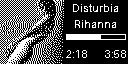
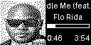
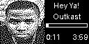
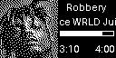
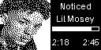
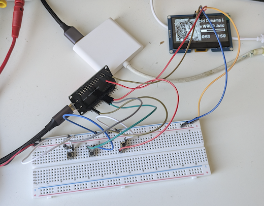

# Spotify ESP32 Display

An ESP32 OLED display and button controller for Spotify playback. A FastAPI server fetches playback data, renders a monochrome frame, and sends it to the device over WebSocket.

## Display examples

<p>
  
  
  
  
  
  
</p>

Track and artist text scrolls when it is too long for the display. The server searches the artist image for a face and uses the first face it finds; if no face or artist image is available, it falls back to the track's album artwork.

## Wiring



## Project layout

- [`server/README.md`](server/README.md) — server setup, Spotify authorization, and debugging.
- [`esp32/README.md`](esp32/README.md) — ESP-IDF setup, wiring, secrets, and flashing.

## Run

Start the server from `server/`:

```sh
pip install -r requirements.txt
fastapi run main.py --host 0.0.0.0 --port 8000
```

Visit `http://localhost:8000/login` to authorize Spotify. Configure the ESP32 Wi-Fi credentials and server address in `esp32/main/secrets.h` and `esp32/main/websocket.cpp`, then build and flash it with ESP-IDF:

```sh
idf.py build flash monitor
```
